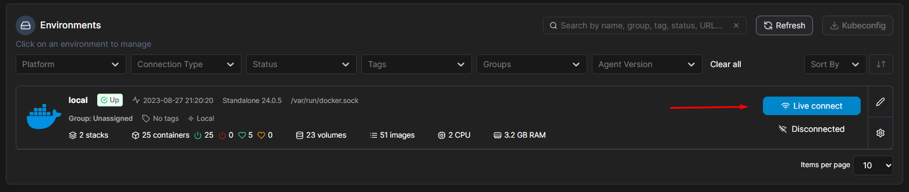
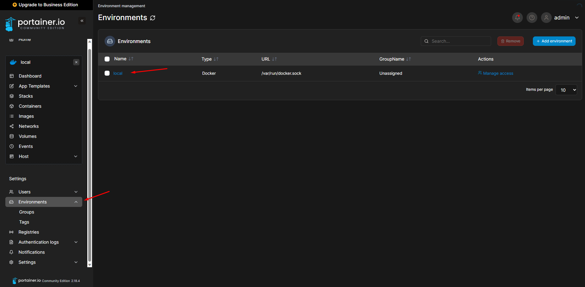
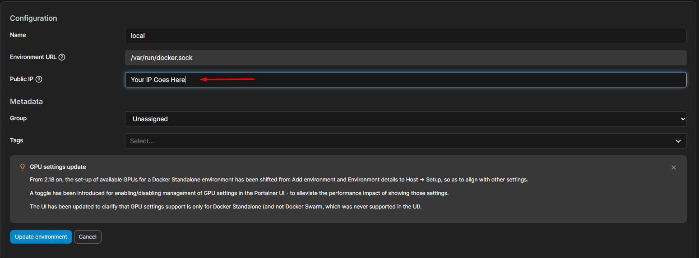
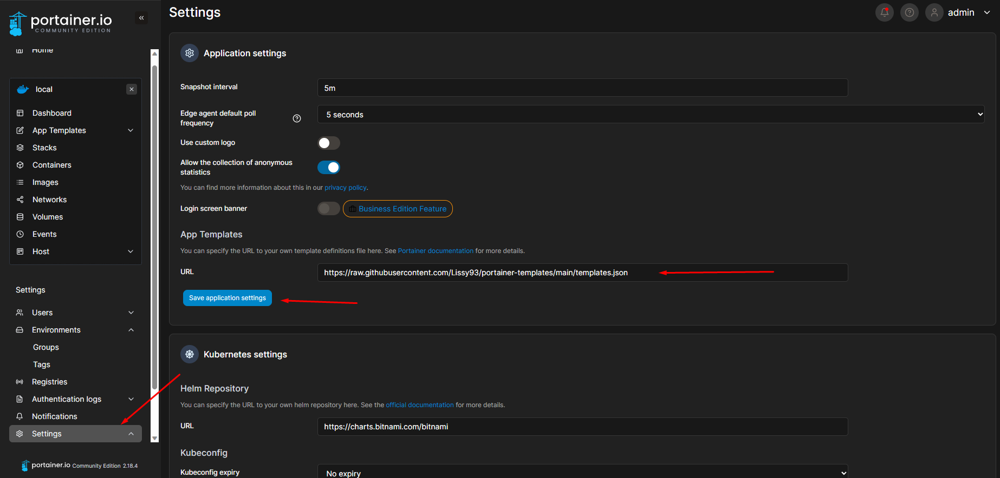
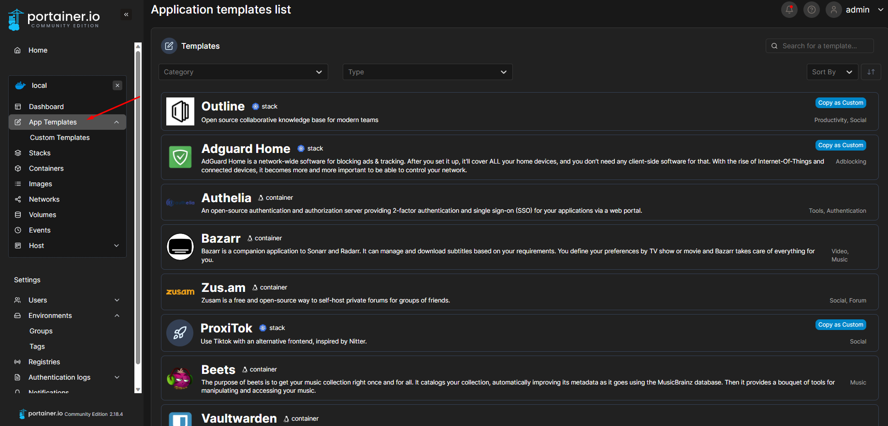

# Configuring Portainer
#### Now you need to configure your portainer to use it as your main docker containers and images manager

## 1. Configuring local IP for portainer's dockers interfaces
- Live connect yo your local docker

- Go to Enviroment and then click local

- Then Add your Server local `IP address` here

## 2. Adding new Portainer Template Repository to get 100+ Updated Dockers!
- Go to Settings
- Change the existing URL to this [Repo](https://raw.githubusercontent.com/Lissy93/portainer-templates/main/templates.json)
- Then Click Save

***Now when you go to App Tempelates you will find A LOT of Tempelates you can you in your home lab as you want!***

