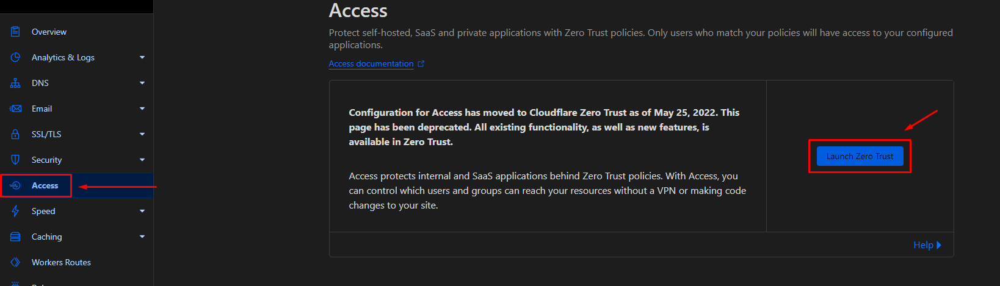
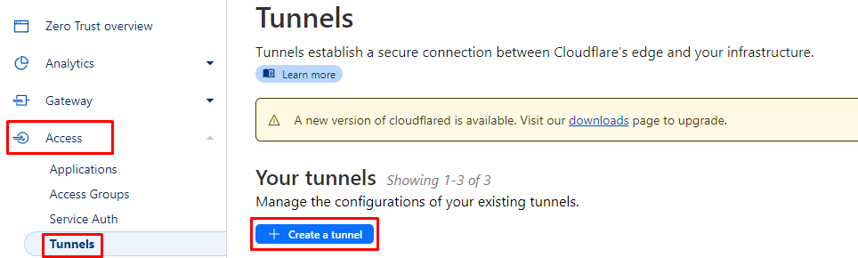
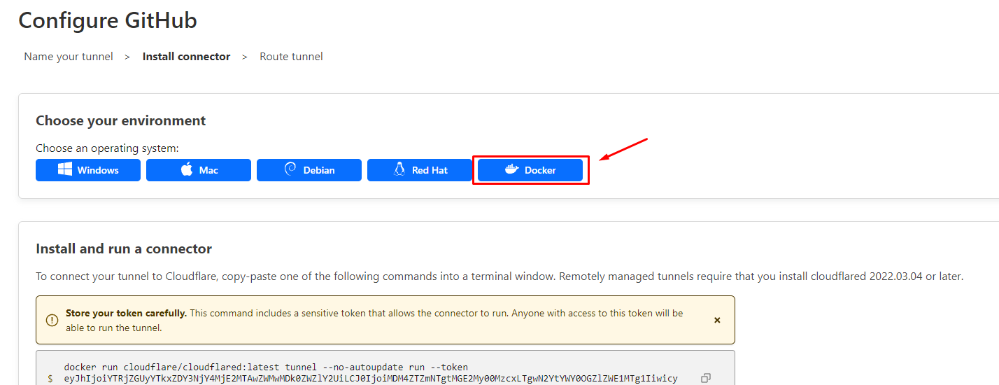
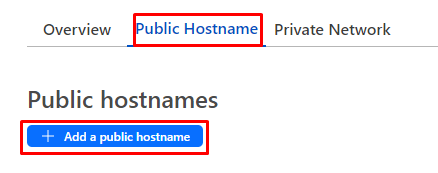
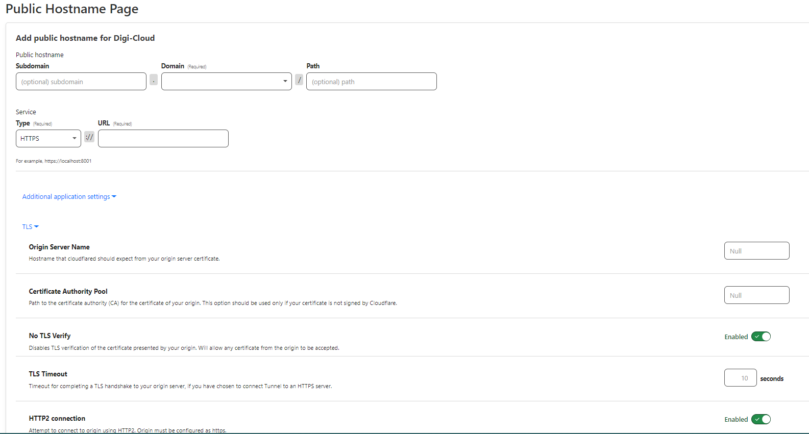

# Cloudflare Tunneling
#### Cloudflare Tunnel connects your local services to Cloudflare's global network, enhancing security, performance, and reliability. It secures the connection, optimizes traffic, and bypasses firewalls for restricted resources. It's particularly useful for exposing private resources and maintaining stable connections despite changing IP addresses.

***In other words, It exposes your local network (specific interfaces that you choose to expose) into the public network to access it from anywhere.***

## First of all, you need to get yourself a domain name.
You can buy one from [namecheap](https://www.namecheap.com/domains/) or any other provider .
Once your domain is ready and pointing at the IP address of your server (or VPS), go ahead and create an account on cloudflare.
Once your domain is ready and DNS records are set up (you should have at least 2 A-records pointing to the IP address of your Domain)
Once your domain is ready and configured with DNS records, you will be able to access it through the tunnel.
### 1. Create an account on cloudflare
Create an account if not already done so by going here: https://dash.cloudflare.com/. You'll have to verify your email address first before
### 2. Choose Free Plan
### 3. Enable Access and Zero Trust Feature
- Once you connect your domain to cloudflare
- Click on Access option
- Then Launch Zero Trust


### 4. Get along with the configuration
- Just a couple of steps to verify your identity just get along with it (It will ask you for your payment method but don't worry it won't charge you anything and it's completly FREE)
### 5. Start setting your tunnel
- Go to Access Option
- Select "Tunnels" tab in left side menu bar
- Add new tunnel by clicking "+ New Tunnel".

- Give your tunnel a Name (e.g: mytunnel).
- Set up the subdomain for which you want to create a tunnel.(e.g : dev.mydomain.com )
- Install Connector
- Pick your favorite connecter (In this case we will use Docker Connecter)

It will be like this
```
docker run cloudflare/cloudflared:latest tunnel --no-autoupdate run --token eyJhIjoiYTRjZGUyYTkxZDY3NjY4MjE2MTAwZWMwMDk0ZWZlY2UiLCJ0IjoiMDM4ZTZmNTgtMGE2My00MzcxLTgwN2YtYWY0OGZlZWE1**********wicyI6Ik16VmhZemhrTW1JdE9UYzVOaTAwWXpsakxUZzJZMlF0WkRaa1pEVXpZVFkyTlRnMCJ9
```
- You will get a green pop-up message in the end of the screen to confirm that your connector is succesfully installed
- Now click on save button at bottom right corner
- You are done! Your tunnel has been created successfully.
- Go to Public Hostnames Tap
- Then Click on "Add a Public hostname"


- **Subdomain** - Pick a subdomain for your service
- **Domain** - Choose your own domain name that you have bought earlier(e.g: mydomain.com ). This should match exactly
- **Protocol** - HTTP or HTTPS
- **Hostname** - localhost (this should match with hostname that we have set while running our local server.)
- **Port Number** - Enter your service port number

- After filling out these details click on “Create”. You’ll see something like this below after creating the tunnel successfully.
***Note: If you chose HTTPS you'll need to click on "addtional application settings" and then "TLS" and enable  "No TLS Verify" and "HTTPS2 Connection"***
- Now click on “Create”. You’ll see something like this after creating a tunnel successfully.

## Now you can access your local self-hosted service over the Internet from anywhere with SECURE HTTPS TUNNEL!