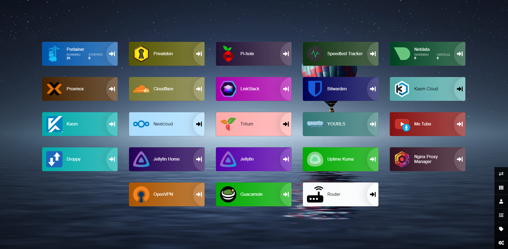

# Heimdall Dashbord
##### It's offering a single interface for accessing self-hosted services. It simplifies service management, supports web apps and media servers, and streamlines deployment and updates, enhancing the accessibility of self-hosted applications.


## 1. Heimdall installation using portainer
- ### 1.1 Go to Portainer App Templates
- ### 1.2 Search for `Heimdall`
- ### 1.3 Click on `Heimdall`

- ### 1.4 Fill in the required fields
    - #### 1.4.1 To Set the ports click on `show advanced options`
    
    - #### Then put your port mapping options here and "NEVER change the RIGHT side ports ONLY change the LEFT ones" and make sure that the LEFT ports never used before.
    
- Click on `Deploy the container`.

***Note: Sometimes for other containers you need to make more changes or manually create some pathes to complete the installation, so read well the instruction of every container***

## Now you have your Heimdall up and running just access its interface using your browser by typing
```
http://<your_server_ip>:<your_port>
```
