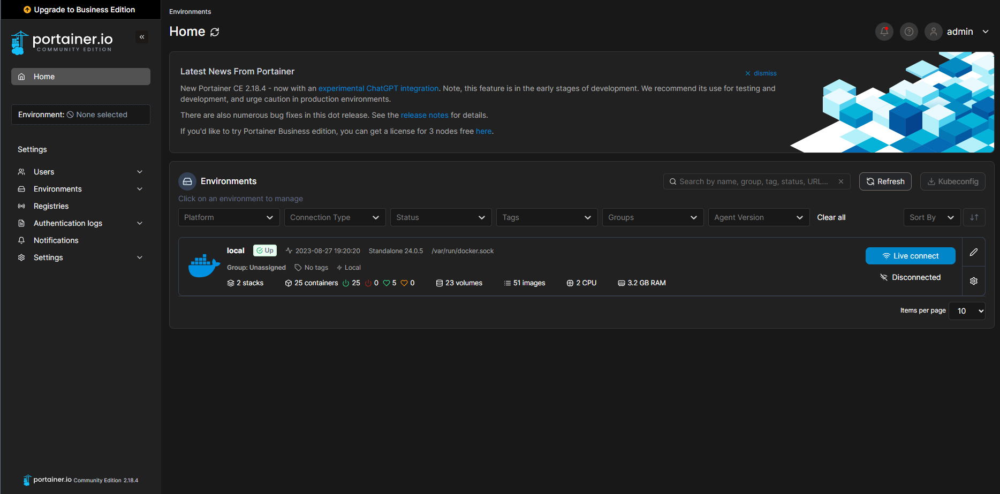
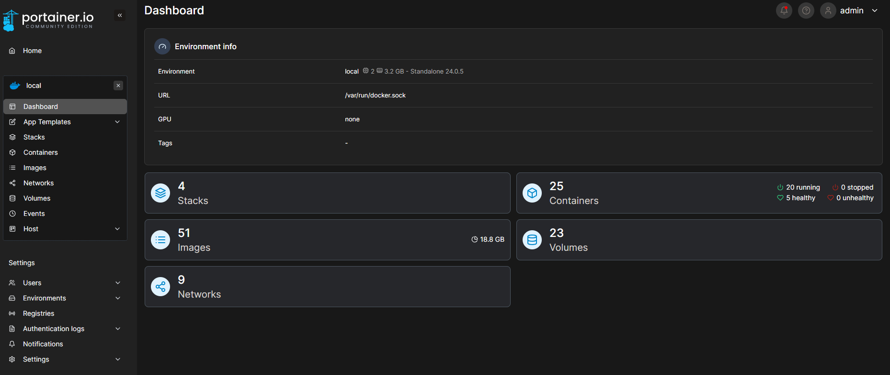
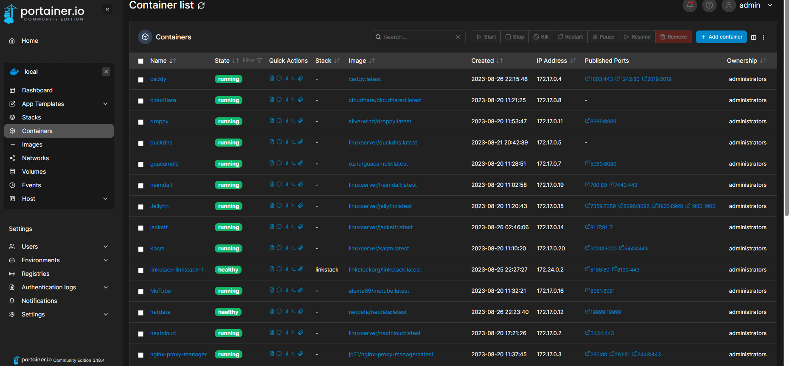
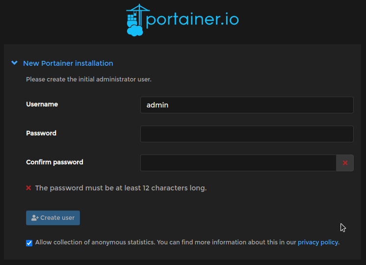

# Portainer installation

##### Portainer is an open-source container management platform with a user-friendly web interface for Docker, Kubernetes, and Docker Swarm. It simplifies container deployment, monitoring, and access control, making it ideal for small to medium-sized teams and educational purposes, while offering rapid prototyping and streamlined distributed deployment management.





***For more simplicity, It's web interface to creating and managing all your docker containers, images, stacks, and more!***

## Step-by-Step Installation:
### 1. SSH to your Ubuntu Container:
- To do this, open a terminal window or command prompt on your computer, then enter the following command into the terminal/command prompt window:
- To do this, open a terminal window on your computer.
- Type `ssh root@<IP>` where `<IP>` is replaced by the IP address of the Ubuntu container.
- Press Enter.
### 2. Create the volume that Portainer Server will use to store its database:
```bash
docker volume create portainer_data
```
### 3. Run Portainer in Docker:
```bash
docker run -d -p 8000:8000 -p 9443:9443 --name portainer --restart=always -v /var/run/docker.sock:/var/run/docker.sock -v portainer_data:/data portainer/portainer-ee:latest
```
### 4. Check if every thing running well by typing:
```bash
docker ps
```
You should get somthing like this:
```bash
CONTAINER ID   IMAGE                          COMMAND                  CREATED       STATUS      PORTS                                                                                  NAMES             
de5b28eb2fa9   portainer/portainer-ee:latest  "/portainer"             2 weeks ago   Up 9 days   0.0.0.0:8000->8000/tcp, :::8000->8000/tcp, 0.0.0.0:9443->9443/tcp, :::9443->9443/tcp   portainer
```
### 5. Logging In:
- Now that the installation is complete, you can log into your Portainer Server instance by opening a web browser and going to:
```
https://localhost:9443
```
You should get this interface:


***And once you finish your configurations you should be redirected to your [portainer interface](image-5.png).***

Portainer Official Installation instruction:
https://docs.portainer.io/start/install/server/docker/linux