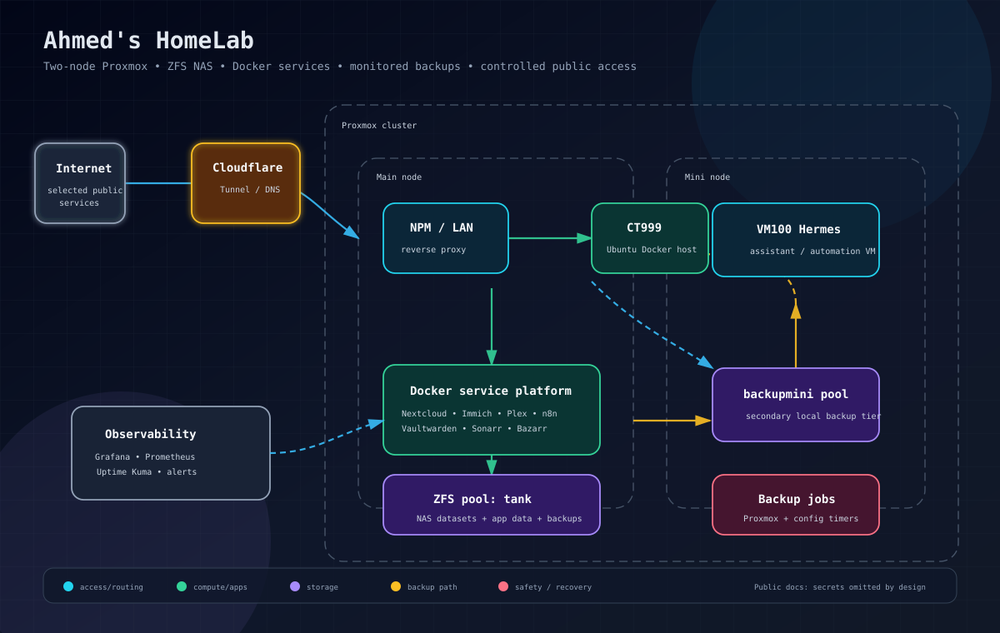
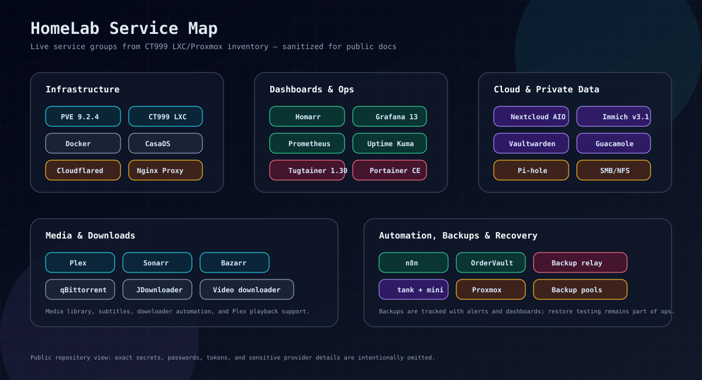

# HomeLab

  

  
  
  
  
  

A living documentation repo for my current self-hosted homelab.

This repository started as a beginner guide for turning an old PC into a Proxmox + Docker home server. The current environment has grown into a two-node Proxmox setup with ZFS-backed NAS storage, a central Docker services container, private and public access layers, monitoring, backups, and media/cloud automation.

> Security note: this is public documentation. Keep real passwords, API tokens, tunnel tokens, recovery keys, private hostnames, and provider credentials out of the repo.

## Current architecture

- **Proxmox cluster** with two nodes:
  - Main node: primary compute/storage host
  - Mini node: secondary node running the Hermes VM and backup storage
- **Main Ubuntu LXC / Docker host**:
  - Runs most self-hosted applications
  - Provides SMB/NFS NAS access
  - Hosts Docker, CasaOS, Portainer, Homarr, Nginx Proxy Manager, monitoring, media services, and automation tools
- **ZFS storage**:
  - Main pool for NAS/application data
  - Secondary pool for backup tier
- **Access layers**:
  - Local LAN access
  - Nginx Proxy Manager for local reverse proxying
  - Cloudflare Tunnel for selected public services
- **Observability and backups**:
  - Grafana + Prometheus stack
  - Uptime Kuma checks
  - Proxmox backup jobs and alert relay

## Documentation map

- [Architecture overview](docs/01-architecture-overview.md)
- [Network and access model](docs/02-network-and-access.md)
- [Proxmox cluster](docs/03-proxmox-cluster.md)
- [Storage, NAS, and ZFS](docs/04-storage-nas-zfs.md)
- [Docker host and service catalog](docs/05-docker-host-and-services.md)
- [Public access and reverse proxy](docs/06-public-access-and-reverse-proxy.md)
- [Backups and monitoring](docs/07-backups-and-monitoring.md)
- [Maintenance and recovery notes](docs/08-maintenance-and-recovery.md)
- [Original v1 tutorial archive](docs/legacy-v1-original-guide/)

## Current service groups

  

### Core infrastructure

- Proxmox VE
- Ubuntu LXC Docker host
- Docker / Docker Compose
- CasaOS
- Portainer
- Tugtainer
- Nginx Proxy Manager
- Cloudflared
- Samba / NFS
- Pi-hole

### Dashboards and monitoring

- Homarr
- Grafana
- Prometheus
- Node Exporter
- Blackbox Exporter
- Uptime Kuma

### Media and downloads

- Plex
- Sonarr
- Bazarr
- qBittorrent
- JDownloader
- Social video downloader
- Telegram media downloader

### Cloud and personal data

- Nextcloud AIO
- Immich
- Vaultwarden
- Guacamole

### Automation and custom apps

- n8n
- OrderVault
- Backup alert relay

## What changed since the original guide

The original documentation covered a simple path:

1. Install Proxmox on an old PC.
2. Create an Ubuntu container.
3. Install Docker.
4. Install Portainer.
5. Add Heimdall, Cloudflare Tunnel, and VPN basics.

The current system is now closer to a small production homelab platform:

- Two Proxmox nodes instead of one standalone host
- ZFS pools and NAS datasets instead of basic local storage
- Multiple dashboards instead of only Heimdall
- Public and local reverse proxy layers
- Monitoring and backup observability
- Media automation, cloud storage, password management, and custom tools

## Update policy

- Document architecture and operating procedures, not secrets.
- Prefer examples and placeholders for sensitive host-specific values.
- Keep destructive commands out of quick-start sections.
- Backup before changing services.
- Verify services after restart or update.
