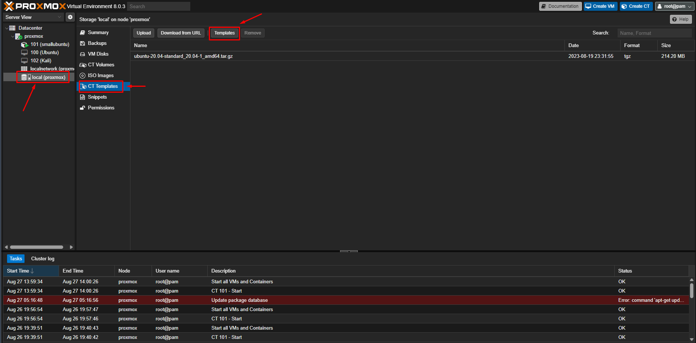
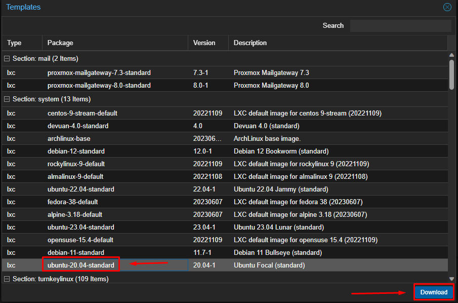
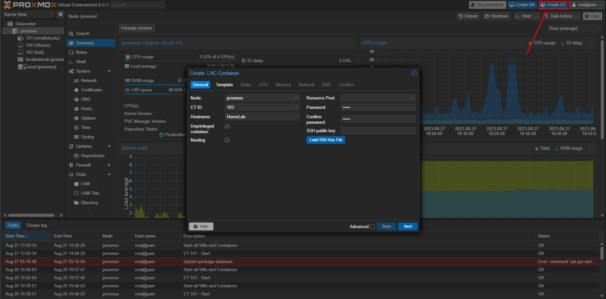
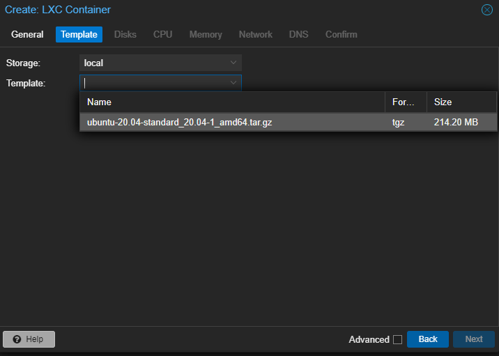

# Lightweight Ubuntu Container with Docker
### Now you need a lightweight system to manage your Home lab and Dockers which we will install later
***❗You should read [Proxmox.md](Proxmox.md) first❗***
### 1. Log in to Proxmox Web Interface:
- Open a web browser and navigate to your Proxmox server's IP address followed by port 8006 (e.g., https://your_server_ip:8006).
- Log in with your Proxmox admin credentials.
### 2. Download Ubuntu Container:
1. Go to local (proxmox)
2. Go to CT Templates
3. Click on Templates

4. Now you have A LOT of options to download, but for now we will stick to Ubuntu 20.04 

### 3. Create an Ubuntu Container:
- In the Proxmox web interface, click on "Create CT" (CT stands for Container).
- Select "Ubuntu" as the template for the container.


### 4. Configure Your New Ubuntu Container:
- Configure the resources for your container, including CPU cores, memory, and swap space.
### 5. Network:
- Configure the network settings for your container. You can choose from different network modes like DHCP or manual IP assignment. ***For our server you need to should confgure a STATIC IP***
### 6. Storage:
- Choose the storage location where the container's files will be stored. You can select an existing storage pool or create a new one.
### 7. Confirm Settings:
- Review the settings you've configured for the container.
- Click "Next" to proceed.
### 8. Start the Ubuntu Container:
- After confirming that all the settings are correct, click on "Start".
- The new Ubuntu container should start up within a few seconds.
### 9. Connect to the Ubuntu Container:
- Once the Ubuntu container has started successfully, connect to it by clicking on its name under the list of containers.
- Once the Ubuntu container has started up successfully, connect to it using SSH.
- To do this, open a terminal window or command prompt on your computer, then enter the following command into the terminal/command prompt window:
- To do this, open a terminal window on your computer.
- Type `ssh root@<IP>` where `<IP>` is replaced by the IP address of the Ubuntu container.
- Press Enter.
- You should see some output similar to the following:
```bash
Welcome to Ubuntu 20.04.1 LTS (GNU/Linux 5.4.0-42-generic)
* Documentation: https://help.ubuntu.com
Last login: Tue Mar  9 11:17:53 2021
root@ubuntu:/home/ubuntu#
```
### 10. Update & Upgrade your Ubuntu
```bash
sudo apt update && sudo apt upgrade -y
```

## 11. Install Docker Engine on Ubuntu Container:
#### 11.1 Add Repositories:
- First add the repository key GPG file from the official Docker repositories.
- This can be done by running the command below:
```bash
curl -fsSL https://download.docker.com/linux/ubuntu/gpg | sudo apt-key add -
```
#### 11.2 Update Package Lists:
- Next update the package lists on your system so that any newly added packages or their dependencies can be installed.
- Next update package lists so that they reflect the latest packages available.
- Run the command below to accomplish this task:
```bash
sudo apt-get update
```
#### 11.3 Install Packages:
- Finally install the docker engine and containerd packages needed to run docker containers on ubuntu.
- Run the commands below to accomplish this task:
```bash
sudo apt-get install ca-certificates curl gnupg lsb-release
```
#### 11.3 Install Docker and Docker-Compose:
```bash
sudo apt install docker.io docker-compose -y
```