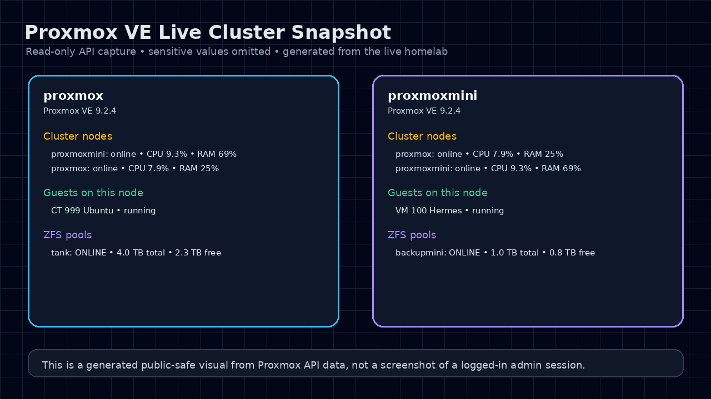

# Proxmox cluster

## Current role

Proxmox is the base virtualization layer for the homelab. It manages:

- The main Ubuntu LXC / Docker host
- The Hermes VM
- ZFS storage pools
- Backup storages
- Cluster-wide management view

## Nodes

```text
Main node
  Role: primary storage and Ubuntu LXC host
  Key workload: Ubuntu LXC running Docker/NAS apps

Mini node
  Role: secondary node and backup tier
  Key workload: Hermes VM
```

## Workloads

```text
CT999  Ubuntu   Main Docker/NAS/app host
VM100  Hermes   Hermes Agent VM
```

## Cluster notes

A two-node Proxmox cluster is useful for a single management UI, but it is not the same as a fully resilient HA cluster.

Important notes:

- Two-node quorum can be fragile without a QDevice or third vote.
- Do not enable HA casually in a two-node-only design.
- Keep direct SSH/browser access to both nodes available.
- Back up `/etc/pve`, storage config, and guest configs before cluster-level changes.

## Safe operating rules

Before changing Proxmox storage, disks, or cluster configuration:

1. Run discovery first.
2. Identify disks by stable `/dev/disk/by-id/` paths, not `/dev/sdX`.
3. Confirm which node owns which storage.
4. Back up relevant configs.
5. Make one change at a time.
6. Verify the cluster view, guest state, storage state, and service reachability after changes.

## Useful read-only checks

```bash
pveversion -v
pvecm status
pvesm status
qm list
pct list
zpool status
zfs list
```

Do not run destructive disk or pool commands from documentation snippets without a fresh discovery pass.

## Live visual snapshot

<p align="center">
  
</p>

This visual is generated from read-only Proxmox API data instead of a logged-in admin UI screenshot, so it can show the current cluster shape without exposing privileged interface details.
