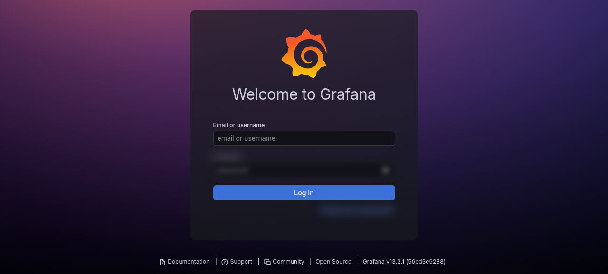

# Backups and monitoring

## Backup model

The current homelab uses a layered backup approach.

Recommended layers:

1. **ZFS snapshots** for fast rollback of datasets
2. **Proxmox VM/CT backups** for guest recovery
3. **Secondary local backup storage** for another recovery tier
4. **App-aware exports** for databases and stateful services
5. **Optional encrypted offsite backups** for critical data
6. **Restore tests** to prove backups actually work

## Current backup-related components

- Proxmox backup storages
- Main storage backup tier
- Mini-node backup tier
- Backup alert relay to notify about Proxmox backup events
- Grafana dashboard tracking backup freshness/health

## Important backup warning

Proxmox CT/VM backups may not include large bind-mounted NAS datasets if those mounts are configured with `backup=0`. That is usually intentional, but it means the NAS datasets need their own backup/snapshot/replication strategy.

## App-aware backups

Use application-aware backups for:

- Nextcloud AIO database/config
- Immich Postgres and media library metadata
- n8n workflows/credentials/database
- Vaultwarden SQLite/database files
- Custom apps such as OrderVault
- Any Docker app with a database

Do not rely only on copying live database files unless the app documents that it is safe.

## Monitoring stack

Current monitoring components:

```text
Grafana             Dashboards
Prometheus          Metrics collection
Node Exporter       Host metrics
Blackbox Exporter   Endpoint checks
Uptime Kuma         Service uptime/status checks
Backup alert relay  Proxmox backup event notifications
```

## What to monitor

Recommended checks:

- Proxmox node reachability
- ZFS pool health
- Disk SMART health
- Backup age and last backup status
- Docker host reachability
- Important service HTTP status
- Public hostname availability
- Free disk space
- Memory pressure
- Container health states

## Restore testing

A backup that has never been restored is only a backup attempt.

Suggested restore tests:

- Restore one small CT/VM backup to a temporary ID
- Verify one app database export can be read
- Verify one NAS dataset/file restore path
- Document exact restore steps after every successful drill

## Live UI snapshot: monitoring entrypoint

<p align="center">
  
</p>

This is a sanitized live capture of the Grafana monitoring entrypoint. It confirms the monitoring UI is present without exposing dashboard data or credentials.
